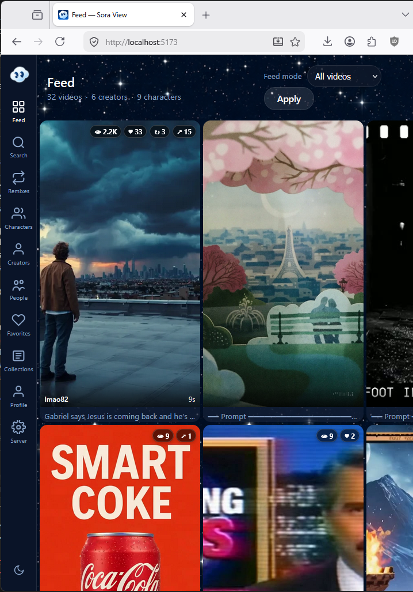
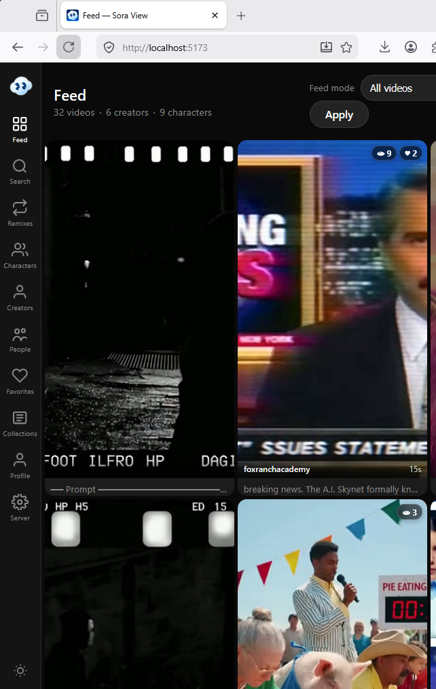
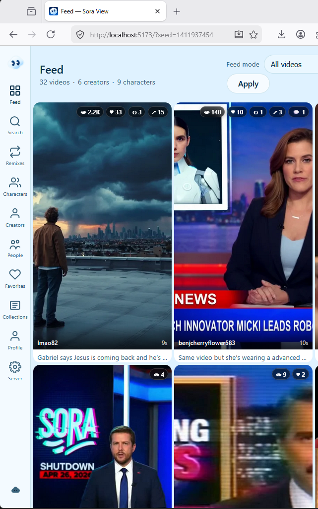
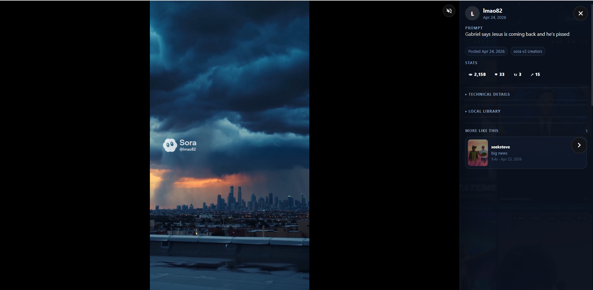
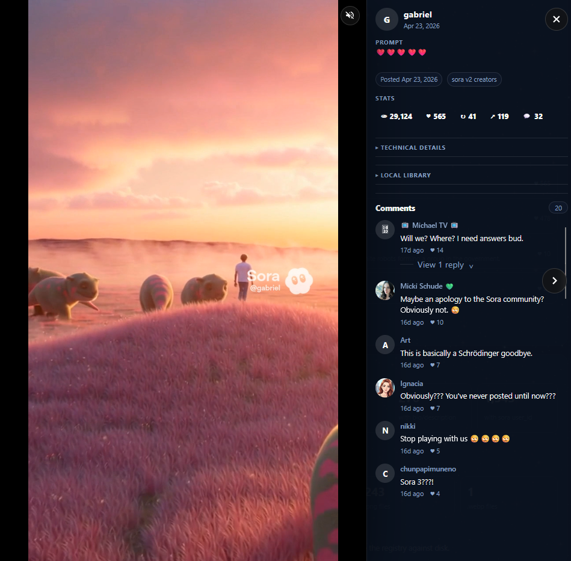
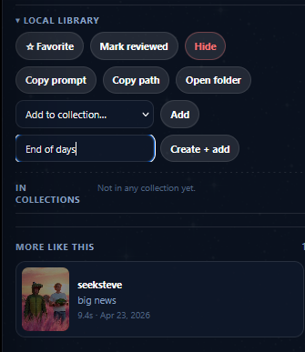
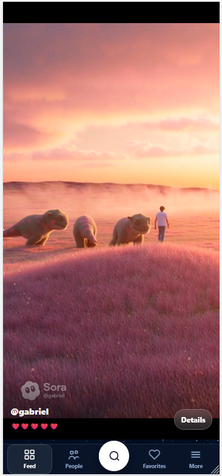
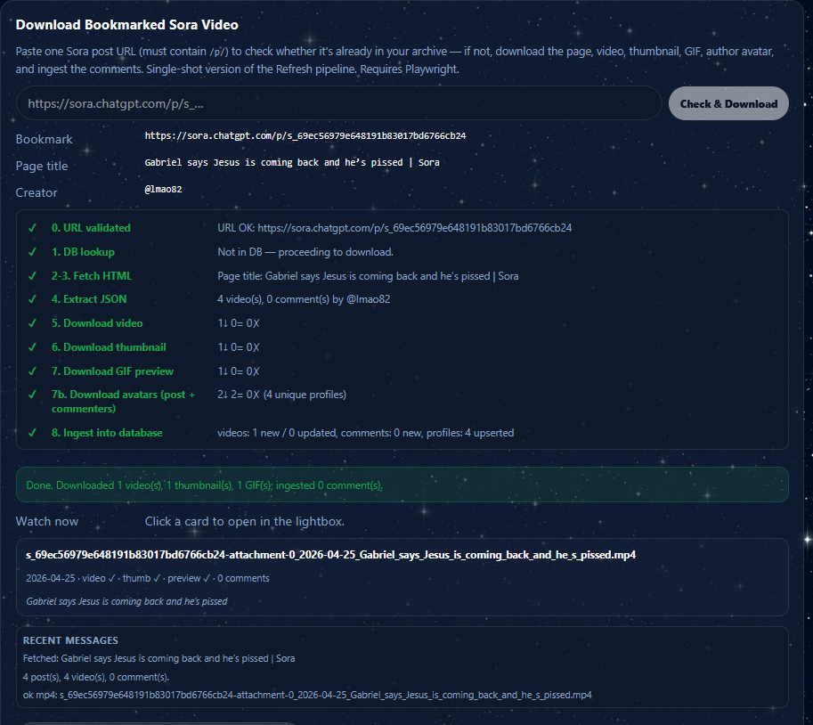

# Sora View Lite

A local-first viewer for SoraVault archives. While Sora is no longer available — Sora View Lite lets you keep enjoying the videos, prompts, creators, characters, comments, and remix history you saved with [SoraVault](https://github.com/charyou/SoraVault) by [Sebastian Haas](https://github.com/charyou). Everything renders from files on your own computer; no accounts, no telemetry, no remote calls.

  

---

## Quick start (no terminal needed)

1. **Install Node.js** 20.19+ or 22.12+ from [nodejs.org](https://nodejs.org).
2. **Download or clone this repo** somewhere on your computer.
3. Double-click the launcher for your OS:
   - Windows → `start.bat`
   - macOS → `start.command` (if macOS warns, allow it in System Settings → Privacy & Security)
   - Linux → run `./start.sh` from a terminal, or right-click → "Run in terminal"
4. The first run installs dependencies and builds the app. After that it opens your browser at <http://localhost:5173>.
5. On first launch you'll be walked through a short setup that asks where your SoraVault archive folder lives and which database engine to use.

That's it — leave the launcher window open while you're using the app, close it (or press `Ctrl+C`) when you're done.

---

## What you get

- **Browse everything you saved.** Feed, search, creators, characters, people (cameos), favorites, collections, the most-commented threads, and a duplicate-candidates view all read directly from your local archive.
- **Play videos right in the browser** with their original prompts, comments, remix chains, parent posts, and per-video stats.
- **Picks up videos you added yourself.** Any `.mp4` you drop into one of the recognized SoraVault folders gets indexed and shows up in the feed alongside the rest — see [Folders the app reads from](#folders-the-app-reads-from) below.
- **Local favorites and collections** that don't change anything in your archive — just metadata stored alongside it.
- **Three themes** in the sidebar toggle: dark, light, or **Sora** (a starfield background and translucent navy chrome that mirrors the post-shutdown mobile UI).
- **Mobile-friendly layout** with a five-item bottom nav and a prominent center search button.
- **Optional LAN access** with QR codes so you can browse from your phone on the same network.

### Three themes

Sora Stars / Dark / Light modes — cycle the toggle in the sidebar to switch.

<table>
  <tr>
    <td align="center"> <b>Sora</b></td>
    <td align="center"> <b>Dark</b></td>
    <td align="center"> <b>Light</b></td>
  </tr>
</table>

### Playback and library tools

Every video opens into a full-screen player with the creator info, stats, and comments alongside. The same lightbox shows up everywhere — Feed, Search, Creators, Collections, the bookmark download success cards.

  

When the original post had comments and they were captured (via Refresh Sora Assets or the bookmark download), they live in the same side panel — author avatar, text, like counts, posted-at, and all.

  

Inline library actions on every video: favorite, mark reviewed, hide, copy prompt or path, open the containing folder, and add the video to an existing collection or create one on the fly.

  

### On mobile

Swipe up to scroll to the next video. New bottom navigation for Sora View Lite.

  

### Folders the app reads from

When you point Sora View Lite at your archive root, it walks these top-level folder names looking for `.mp4` files (case-insensitive). Anything sitting underneath one of these is fair game — including videos you downloaded yourself from somewhere else and filed under the matching creator name.

| Folder | What it's for |
|---|---|
| `sora_v2_creators/<username>/` | Main per-creator archive (where SoraVault puts the bulk of your library) |
| `sora_v2_liked/<username>/` | Posts you liked, grouped by their author |
| `sora_v2_profile/<username>/` | Your own profile exports |
| `sora_v2_drafts/<username>/` | Draft / unpublished posts |
| `sora_v2_remixes/parents/<username>/` | Original posts a remix descends from |
| `sora_v2_remixes/downstream/<username>/` | Remixes that descend from one of your posts |
| `downloads/<username>/` | A general bucket — drop manually-saved videos here |
| `sora_downloads/<username>/` | Same as `downloads/`, accepted as an alias if you prefer the `sora_` prefix for naming consistency |
| `mirror_browse/<username>/` | SoraVault's passive mirror-mode capture |

If a video's filename follows the SoraVault convention (`s_<id>-attachment-N_YYYY-MM-DD_<text>.mp4`), the importer can pull post-id, generation-id, date, and prompt straight from the name. Otherwise it indexes the file with whatever metadata the path gives it (creator from the parent folder, etc.). Re-run the import from Server → Import & Scan after dropping new files in.

### Thumbnails: official or ffmpeg

Each video can have two kinds of thumbnail and either is fine:

- **Official Sora thumbnails** — extracted from each post's manifest (the same image Sora's own UI used). Most "authentic" look. Needs the manifest to still hold a non-expired signed URL — usually means running the Refresh pipeline first to get a fresh URL, or using a recently captured archive. **Server → Assets → "Refresh Sora Assets"** downloads these.
- **ffmpeg-generated thumbnails** — created locally from each video's first frame. No network, no signed URLs, no Refresh needed. **Faster**, and works on any `.mp4` (including videos you dropped in yourself). **Server → Assets → "Generate missing thumbnails"** handles these.

Both methods write to the same filename (`<video>.jpg` next to the `.mp4`), so whichever runs first claims the slot. A common pattern is: run Refresh once for the authentic look, then sweep with ffmpeg to fill anything that didn't come through.

ffmpeg can also generate **animated previews** — short looping WebPs (`<video>.preview.webp`) from each video's first 2.5 seconds, used in the grid hover effect. There's no Sora equivalent for these, so ffmpeg is the only option.

---

## The pages at a glance

| Page | What it shows |
|---|---|
| **Feed** (`/`) | The home grid — every indexed video, browsable in an infinite-scroll layout |
| **Search** (`/search`) | Full-text search across prompts, captions, and creator names |
| **Creators** (`/creators`) | Per-creator landing pages with their bio, follower count, and full library |
| **Characters** (`/characters`) | Sora's named character system, with usage insights for each |
| **People** (`/people`) | Anyone mentioned by `@cameo` in prompts, deduped across the archive |
| **Remixes** (`/remixes`) | Remix chains showing originals and the videos that descend from them |
| **Favorites** (`/favorites`) | Videos you've marked as a favorite locally |
| **Collections** (`/collections`) | User-defined playlists for organizing videos, no upload required |
| **Profile** (`/profile`) | Your own Sora profile data, if you exported it via SoraVault's profile mode |
| **Server** (`/server`) | The admin surface — setup, archive scan, asset jobs, refresh pipeline, themes, LAN access, library tools |

The Server page is also the home of less-frequently-needed views: most-commented threads, duplicate candidates, hidden / reviewed videos, and a timeline of when each batch was added.

---

## Refresh expired Sora links *(optional, advanced)*

SoraVault stores asset URLs as signed Azure links that expire about seven days after they were captured. After that you'll see broken thumbnails or download failures. Sora View Lite includes a five-step **Refresh Sora Assets** pipeline (Server → Assets) that re-fetches each post's server-rendered HTML from `sora.chatgpt.com` with JavaScript disabled and pulls fresh signed URLs from the embedded payload. The official thumbnails, GIF previews, and profile avatars are then downloaded into your existing `sora_v2_creators/<creator>/` and `profiles/<username>/` folders.

> 💡 **The "fetch with JavaScript disabled" technique is original research by this project.** After the live site went down, normal page loads triggered a sunset redirect that wiped the server-rendered HTML. I found that the redirect only fires once the client-side React code runs — so disabling JS leaves the SSR HTML (and its embedded React Server Components payload, including freshly-signed Azure URLs) intact. As far as I know this is the only working method, and the entire refresh + bookmark-download workflow is built on top of it.

The pipeline needs **Playwright + Chromium**, which is an optional dependency to keep the base install lean. Install it with the matching launcher:
- Windows → `install-playwright.bat`
- macOS → `install-playwright.command`
- Linux → `./install-playwright.sh`

(or run `npm run sora:install-playwright` if you prefer the terminal). The download is roughly 250 MB and only needs to happen once.

> ⚠ Sora is no longer available. The refresh pipeline depends on the upstream pages still being reachable and may stop working at any time.

### Download a single bookmarked post

If you have a Sora `/p/` URL you want to grab on its own — without running the full pipeline — paste it into **Server → Assets → Download Bookmarked Sora Video**. The app:

1. Validates the URL (must be a `/p/s_…` post page).
2. Checks your database. If the post is already saved, it opens the existing record in the player and tells you which assets are missing on disk.
3. If it's not in the database, it fetches the page, extracts the metadata, downloads the video, thumbnail, GIF preview, every reachable profile avatar (post author + commenters + cameos), and ingests the row plus its first SSR page of comments. The video is saved alongside your other SoraVault videos using the same filename convention.

#### Try it

If you'd like to confirm the bookmark flow is working before pasting your own URLs, these two are known to be downloadable while the upstream pages are still reachable:

- <https://sora.chatgpt.com/p/s_69ec56979e648191b83017bd6766cb24>
- <https://sora.chatgpt.com/p/s_69eba38e02808191b79c4fc7b3fc3438>

Paste either into the input, click **Check & Download**, and watch the eight-step checklist run.

  
   Eight-step checklist after a successful run, with a clickable Watch-now card and recent messages.

---

## Power-user options

These are all optional — every workflow is also available as a button in the Server panel.

### Database engine

Default is **SQLite** (single file, fast, simple). Larger archives (50k+ videos) or analytics queries may benefit from switching to **DuckDB** under Server → Data & Database. Either engine works for everything; you can switch back at any time.

### LAN access

Server → Access & Security → switch from `local` (127.0.0.1 only) to `lan` (binds to 0.0.0.0). Each non-loopback network interface gets a connect URL and a QR code so you can scan from your phone. Restart the server after switching modes.

### CLI scripts

Every step of the refresh pipeline has an `npm run` shortcut:

| Command | What it does |
|---|---|
| `npm run sora:extract-links` | Step 1: extract permalinks from manifest JSONs |
| `npm run sora:dedupe` | Step 2: combine + filter to unique `/p/` URLs |
| `npm run sora:fetch` | Step 3: Playwright fetch each URL's SSR HTML |
| `npm run sora:extract` | Step 4: parse RSC payloads → `extracted.json` |
| `npm run sora:download` | Step 5: pull avatars, thumbnails, GIFs |
| `npm run sora:refresh-all` | All five steps end-to-end |
| `npm run sora:install-playwright` | One-time Chromium install |

### Standalone HTML processor

For a separate machine or batch job, [`cli/do-all.js`](cli/do-all.js) is a single-file script that takes a directory of saved Sora HTML pages and produces extracted JSONs + downloaded thumbnails, GIFs, and avatars in your existing creator-folder layout. It only uses Node built-ins — drop it on any computer with Node 18+ and run it. See `node cli/do-all.js --help` for options.

---

## Requirements

- **Node.js** 20.19+ or 22.12+ ([nodejs.org](https://nodejs.org))
- **A SoraVault archive** on disk (videos + sidecar JSON + manifests)
- **Optional: Playwright + Chromium** if you want the refresh pipeline (~250 MB)
- **Disk space** roughly equal to whatever your SoraVault export is

Tested on Windows 11, macOS, and Ubuntu.

---

## How it works

Sora View Lite is a [SvelteKit](https://kit.svelte.dev) app that runs on your computer. On first launch it scans your SoraVault folder, parses the per-video JSON sidecars and manifest files, and writes a small index database next to it (SQLite by default). After that, every page reads from local files — videos play from disk, images load from disk, comments and stats come from the index. The app never phones home and never depends on the live Sora service for browsing.

The optional refresh pipeline is the one place that touches the network. It uses Playwright with JavaScript disabled to fetch the static SSR HTML from `sora.chatgpt.com`, parses the embedded React Server Components payload, and downloads any new asset URLs it finds. Files newer than seven days are skipped; older files are re-fetched and replaced only on success — a 403 or sunset page leaves the original untouched, so partial degradation never destroys good data.

---

## Acknowledgements

Huge thanks to **[Sebastian Haas](https://github.com/charyou)** for [SoraVault](https://github.com/charyou/SoraVault), the browser-side tool that made it possible to back up Sora libraries in the first place.  

Built with [SvelteKit](https://kit.svelte.dev), [better-sqlite3](https://github.com/WiseLibs/better-sqlite3), [DuckDB](https://duckdb.org), and [Playwright](https://playwright.dev).

---

## License

Sora View Lite is released under the **MIT License** — see [`LICENSE`](LICENSE) for the full text. The bundled Sora-branded visual assets (favicon, cloud mascot, app icon) are retained for historical preservation under a separate Third-Party Components notice in the same file; their rights remain with OpenAI and we'll swap them for neutral equivalents if a rights holder asks.

This project is not affiliated with, endorsed by, or sponsored by OpenAI.

---

## Helpful?

I hope you find this tool helpful. If you want to help me, please submit your Sora links for me to archive.  Thank you.

---
> **Sora is no longer available.** The refresh and bookmark-download features depend on Sora's old pages still being reachable. They may stop working at any time. Even when the network features stop, your local archive will keep playing.
